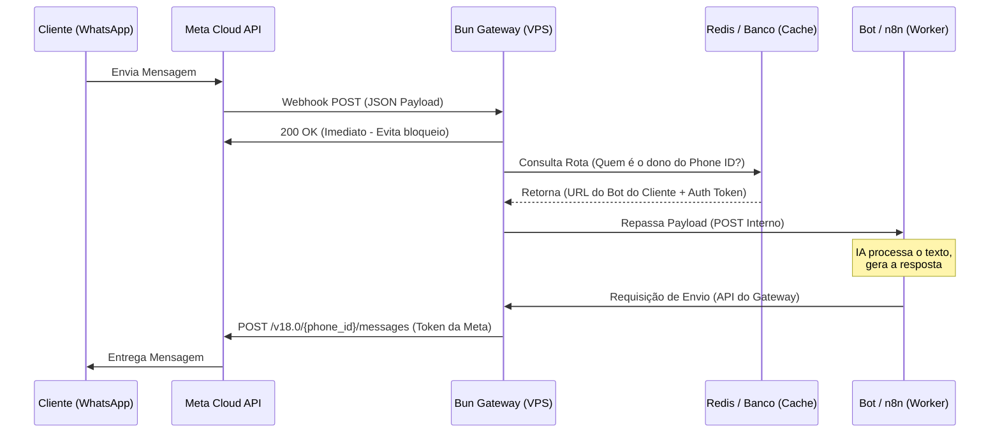

Excelente. O primeiro passo de qualquer infraestrutura Enterprise é documentar o que será construído antes de escrever a primeira linha de código no servidor. Isso evita retrabalho e garante que a fundação suporte o crescimento.

Como seu Arquiteto de IA, preparei o **PRD (Product Requirements Document)** inicial para o nosso "WhatsApp Multi-Tenant Gateway", focado estritamente na infraestrutura core.

---

## PRD: WhatsApp Multi-Tenant Gateway (State of the Art)

**Visão Geral do Produto:**
Um middleware centralizado, ultrarrápido e agnóstico de plataforma, projetado para receber, validar e rotear webhooks da API Cloud Oficial do WhatsApp (Meta) para múltiplos serviços de destino (Bots, n8n, CRMs), além de centralizar o envio de mensagens de volta para a Meta.

**Objetivo Arquitetural:**
Desacoplar a recepção da Meta do processamento da IA. A Meta exige respostas HTTP `200 OK` imediatas. Se o processamento da IA demorar e o webhook der timeout, a Meta bloqueia o número. Este Gateway serve como um "para-choque" e roteador de alta performance.

**Tech Stack Definida:**

* **Runtime:** Bun (Alta performance de I/O, nativo em TypeScript).
* **Hospedagem:** DigitalOcean VPS (Droplet Ubuntu).
* **Proxy Reverso/SSL:** Nginx + Certbot (Let's Encrypt).
* **Cache/State (Futuro):** Redis (Para mapeamento instantâneo de `Phone_ID` para `Bot_URL`).

---

### Diagrama Arquitetural (State of the Art Flow)

Aqui está o fluxo exato que vamos construir, garantindo que nenhum webhook seja perdido e que você possa escalar para centenas de números futuramente:

---

## Passo a Passo: Configuração da Infraestrutura Zero to One

### Fase 1: Setup do Servidor (DigitalOcean)

Para rodar nosso Gateway e receber webhooks da Meta, precisamos de um IP público e HTTPS obrigatório.

1. **Criar o Droplet:**
* Acesse a DigitalOcean e crie um Droplet (plano básico de US$ 5 a US$ 6/mês atende perfeitamente o início).
* Imagem: **Ubuntu 24.04 LTS**.
* Autenticação: Use chaves SSH (nunca senha root, por segurança).

2. **Configuração Inicial do Ubuntu:**
* Acesse via SSH: `ssh root@SEU_IP`
* Atualize os pacotes: `apt update && apt upgrade -y`

3. **Instalar o Bun:**
* Rode o comando oficial: `curl -fsSL https://bun.sh/install | bash`
* Isso instala o Bun globalmente no seu servidor.

4. **Instalar Nginx e Certbot (Obrigatório para a Meta):**
* A Meta não envia webhooks para `http://`. Precisamos de um domínio apontando para o IP do seu Droplet (ex: `api.suaempresa.com.br`).
* Instale o Nginx: `apt install nginx -y`
* Instale o Certbot: `apt install certbot python3-certbot-nginx -y`
* Gere o certificado SSL: `certbot --nginx -d api.suaempresa.com.br`

*Nota Técnica:* Usaremos o Nginx como Proxy Reverso. Ele recebe a requisição HTTPS segura na porta 443 e repassa para o Bun rodando internamente na porta 3000.

### Fase 2: Configuração no Meta for Developers

Aqui é onde você cria o "App Pai" que gerenciará os números.

1. **Criar Aplicativo:**
* Acesse [developers.facebook.com](https://developers.facebook.com).
* Crie um App do tipo **Negócios (Business)**.
* Vincule ao seu Gerenciador de Negócios (BM).

2. **Adicionar o Produto WhatsApp:**
* No painel do App, adicione o "WhatsApp".
* Ele fornecerá um número de teste. Se já quiser usar o real, adicione o seu número na seção "API Setup" (isso exige configuração de perfil do WhatsApp Business).

3. **Gerar o Token Permanente (System User):**
* **Atenção:** O token mostrado na tela de "Get Started" expira em 24h.
* Vá no seu *Business Manager* > *Contas* > *Aplicativos* > *Usuários do Sistema*.
* Crie um usuário, dê permissão ao seu App e gere um token com as permissões `whatsapp_business_management` e `whatsapp_business_messaging`.
* *Por que isso é usado?* Este token não expira e será usado pelo seu Gateway para enviar mensagens eternamente.

4. **Configurar o Webhook na Meta:**
* No painel da Meta, vá em *WhatsApp* > *Configuration*.
* Em Webhook, clique em *Edit*.
* **Callback URL:** `https://api.suaempresa.com.br/webhook` (A URL do seu Nginx/Bun).
* **Verify Token:** Uma senha aleatória que você cria (ex: `MeuTokenSuperSeguro123`). O Bun validará isso na primeira requisição, como mostrei no código anterior.
* Inscreva-se (Subscribe) no campo `messages`.

---

## Validação Técnica do Especialista

> **Isso é escalável?** Sim. O diagrama em Mermaid ilustra o padrão "Publish-Subscribe" via Webhooks. O Gateway atua como um *Load Balancer* lógico. Se o bot final cair ou demorar (latência da OpenAI, por exemplo), a Meta não pune o seu número, pois o Gateway já respondeu `200 OK`.
> **O custo de API inviabiliza o projeto?** O custo de infraestrutura é irrisório (US$ 5/mês do servidor). O custo da Meta é baseado em conversas em janelas de 24h. Ao centralizar o token, você otimiza o uso e não precisa homologar um App novo para cada cliente, o que poupa semanas de burocracia.
